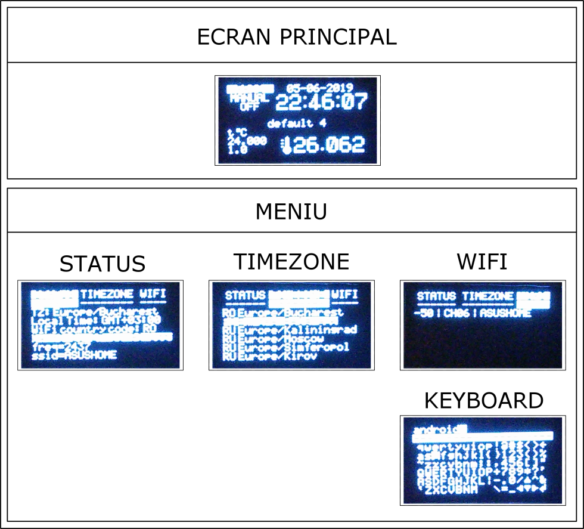

# Licență Bîtcă (Mitrofan) Adrian-Iulian

### Proiect de licență: Aplicație web pentru controlul la distanță al unui termostat

```
|  PROG    23/09/2018  |
| MANUAL [][].[][].[][]|
|  OFF   [][].[][].[][]|
|                      |
|  PROGRAMUL IN CURS   |
|t°C                   |
|25.31   !! [][] [][][]|
| 2.53   !! [][],[][][]|
```

### Conținut foldere

```
/database - două backupuri ale bazei de date (phpmyadmin și mysqldump)
/driver   - codul sursă al driverului (se compilează și instalează înainte de compilarea serviciului)
/html     - conținutul se copie în /var/www/html
/service  - se compilează și se execută în fundal
```

### Date despre softul utilizat

```
Sistem de operare: Raspbian GNU/Linux 9.8 (stretch)
Pachete instalate: mariadb-server libmariadb-dev nginx fcgiwrap php-fpm php-mysql php-zip php-bz2 lynx phpmyadmin ntp
Versiuni:
          mariadb  Ver 15.1 Distrib 10.1.37-MariaDB, for debian-linux-gnueabihf (armv8l) using readline 5.2
          nginx version: nginx/1.10.3
          gcc (Raspbian 6.3.0-18+rpi1+deb9u1) 6.3.0 20170516
          PHP 7.0.33-0+deb9u3 (cli) (built: Mar  8 2019 10:01:24) ( NTS )
          phpMyAdmin-4.8.5
```

### Capturi interfață web de pe telefon cu sistem de operare Android
<table>
  <tr>
    <td align="center"></td>
    <td></td>
    <td align="center"></td>
  </tr>
  <tr>
    <td align="center"></td>
    <td align="center"></td>
    <td align="center"></td>
  </tr>
  <tr>
    <td align="center"></td>
    <td></td>
    <td align="center"></td>
  </tr>
</table>



